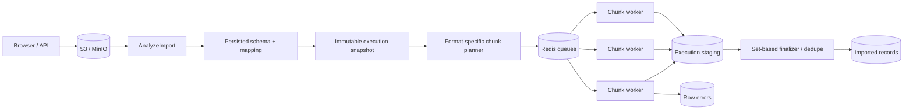

# Import pipeline

HTTP requests never parse the full source. CSV and NDJSON readers stream and use seekable byte ranges when storage provides them. XLSX is a ZIP/XML format, so the worker materializes the workbook to bounded disk storage and iterates the selected worksheet with `XMLReader`; it is chunked by row range rather than pretending compressed XML has safe byte offsets.

Every execution freezes schema version, mappings, transform stages, validation rules, dedupe policy, source options and chunk size. Editing an import after execution starts cannot change the meaning of work already in the queue.

Workers write valid transformed rows to an execution staging table. Finalization uses PostgreSQL set operations/window functions to apply deterministic `keep_first`, `keep_last/upsert`, or `reject` semantics. Therefore worker completion order cannot change dedupe results.
